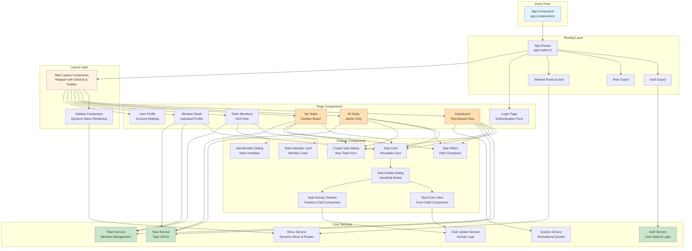
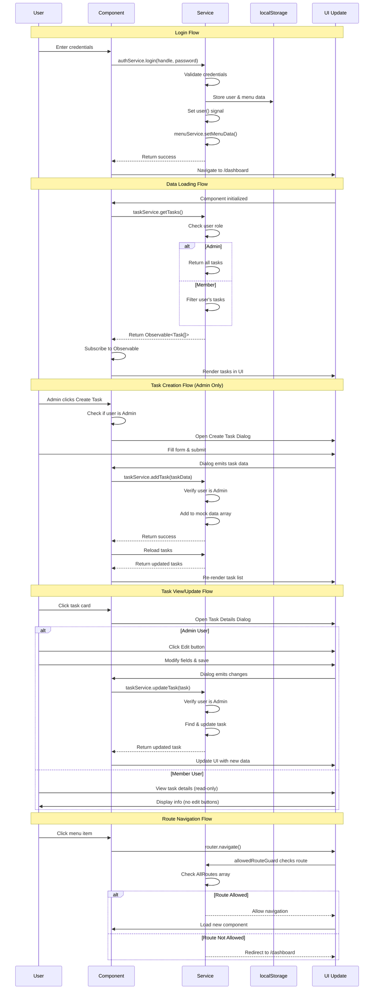
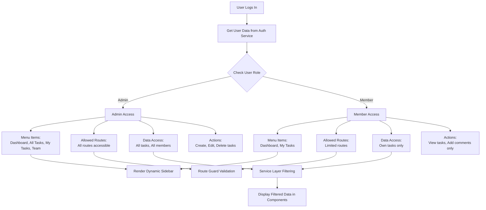

# Task Tracker

## Project Overview

### What is Task Tracker?

Task Tracker is an **enterprise-grade team collaboration and task management system** built with Angular 18. It's a comprehensive productivity application that helps teams organize, track, and manage their work efficiently. The application serves two types of users:

- **Admins**: Team leaders who can view all tasks, manage team members, create tasks for anyone, and monitor overall team performance
- **Members**: Individual team members who can view and manage only their assigned tasks

### How Does It Work?

The application works as a complete task management ecosystem with the following workflow:

1. **User Authentication**: Users log in with their credentials. The system identifies whether they are an Admin or Member and configures their access accordingly.

2. **Dynamic Dashboard**: Based on the user's role, the dashboard displays:
   - **For Admins**: Overview of all team members, all tasks across the team, team statistics, and the ability to create tasks for anyone
   - **For Members**: Personal task overview, only their assigned tasks, and their personal statistics

3. **Task Management**: Users can:
   - **View tasks**: Admin sees all tasks, Members see only their assigned tasks
   - **Create new tasks**: **Admin only** - Can create tasks for any team member
   - **View tasks** in grid layout or kanban board format (three columns: To Do, In Progress, Done)
   - **Click on task cards** to open detailed view in a modal dialog
   - **Edit/Update task details**: **Admin only** through modal dialog
   - **Delete tasks**: **Admin only**
   - **View task activity** with comments, updates, and threaded replies
   - **Add comments** on tasks with reply functionality (all users)
   - **Edit/delete own comments** (all users) or any comment (**Admin only**)
   - **Filter tasks** by status (All, To Do, In Progress, Done)

4. **Team Collaboration**: Admins can:
   - View all team members with their statistics
   - See individual member profiles with their task breakdown
   - Add new team members to the project
   - Monitor team performance metrics

5. **Dynamic Navigation**: The sidebar menu and accessible routes are automatically configured based on the API response during login. This means:
   - Different users see different menu options
   - Route access is enforced by guards checking the allowed routes list
   - The menu structure is completely controlled by the backend

### Technical Implementation

**Current State - Mock Data**:
The application currently runs with **mock data** - all data is stored in memory within services. This allows the application to function fully without any backend server. When you create a task, it's added to an in-memory array. When you update a task, the array is modified.

**Why Mock Data?**:
- Demonstrates complete functionality without infrastructure setup
- Perfect for prototyping and frontend development
- Easy to understand and test

**Future State - API Ready**:
The architecture is intentionally designed to be **API-ready**. This means:
- Only service files need modification when connecting to a real backend
- Components remain completely untouched
- Simply replace `of(mockData).pipe(delay(300))` with `http.get(apiUrl)`
- Add proper error handling and HTTP interceptors
- The application structure already matches expected backend response formats

### Dynamic Menu & Routing System

One of the key features is the **completely dynamic navigation system**:

**How It Works**:
1. User logs in and the backend returns a response containing:
   - User information (name, handle, role)
   - `MenuItems` array: Defines what menu options appear in the sidebar
   - `AllRoutes` array: Defines which routes the user can access

2. The MenuService stores this data in signals and localStorage

3. The Sidebar component reads the MenuItems signal and automatically renders:
   - Menu icons and labels
   - Nested submenus (expandable sections)
   - Active route highlighting

4. Route guards check the AllRoutes array before allowing navigation:
   - If route is in the allowed list → navigation proceeds
   - If route is NOT in the allowed list → redirect to dashboard

**Benefits**:
- No hardcoded menus in frontend code
- Backend controls what each user can see and access
- Easy to add new features without frontend code changes
- Role-based UI is completely flexible

### Key Design Philosophy

**Smart Services, Dumb Components Architecture**:

- **Services (Smart)**: 
  - Contain ALL business logic
  - Handle data transformations
  - Implement role-based filtering (Admin sees all, Member sees only their data)
  - Manage state with signals and observables
  - Act as single source of truth

- **Components (Dumb)**:
  - Purely presentational - just display data
  - No business logic whatsoever
  - Receive data via inject() and subscribe
  - Emit events to parent components
  - Completely reusable and interchangeable

**Why This Matters**:
When requirements change (switching from REST to GraphQL, adding WebSockets, changing business rules), only services need updates. Components continue working without any modifications. This separation ensures:
- Easy testing (test services independently)
- Code reusability (components work with any data source)
- Easy maintenance (business logic centralized)
- Scalability (add features by extending services)

---

## User Roles & Permissions

### Admin Role
**Full System Access**:
- ✅ View all tasks across the entire team
- ✅ Create tasks for any team member
- ✅ Edit/Update any task (title, description, status, priority, assignee, due date)
- ✅ Delete any task
- ✅ View all team members with statistics
- ✅ Add new team members
- ✅ Access team member detail pages
- ✅ Add comments on any task
- ✅ Edit/Delete any comment (own and others)
- ✅ Reply to comments
- ✅ Access routes: Dashboard, All Tasks, My Tasks, Team, Member Detail, Profile

### Member Role
**Limited Personal Access**:
- ✅ View only their own assigned tasks
- ❌ Cannot create any tasks
- ❌ Cannot edit or update any tasks (view-only)
- ❌ Cannot delete any tasks
- ❌ Cannot view team members list
- ❌ Cannot access other member profiles
- ✅ Add comments on tasks they can view
- ✅ Edit/Delete only their own comments
- ✅ Reply to comments
- ✅ Access routes: Dashboard, My Tasks, Profile

### Authorization Matrix

| Action | Admin | Member |
|--------|-------|--------|
| View all tasks | ✅ | ❌ (only own tasks) |
| View own tasks | ✅ | ✅ |
| Create task | ✅ | ❌ |
| Edit any task | ✅ | ❌ |
| Delete any task | ✅ | ❌ |
| View team members | ✅ | ❌ |
| Add team members | ✅ | ❌ |
| Add comment | ✅ | ✅ |
| Edit own comment | ✅ | ✅ |
| Edit any comment | ✅ | ❌ |
| Delete own comment | ✅ | ✅ |
| Delete any comment | ✅ | ❌ |

---

## Application Workflow - Detailed Explanation

### Complete User Journey

#### 1. Application Startup

**What Happens When User Opens the App**:

1. **App Component Initialization**:
   - Angular application bootstraps and loads `AppComponent` (root component)
   - AppComponent contains the root `<router-outlet></router-outlet>`
   - This is the **first router outlet** at the application root level

2. **Initial Route Resolution**:
   - Angular Router evaluates the URL
   - Checks route configuration in `app.routes.ts`
   - Routes are configured with a root path and child paths

3. **Authentication Check**:
   - AuthService reads `localStorage.getItem('isLoggedIn')`
   
4. **If authenticated** (localStorage has token):
   - User data is restored from localStorage
   - Menu data is restored from localStorage
   - AuthService sets the user signal with stored data: `user.set(storedUserData)`
   - MenuService sets menu and route signals: `menuService.setMenuData(storedMenuData)`
   - User is automatically redirected to `/dashboard`
   - Router navigates through root router outlet
   
5. **If not authenticated** (no localStorage data):
   - Router loads `/login` route through root router outlet
   - LoginComponent renders in the root `<router-outlet>`
   - No data in signals
   - All authenticated routes are blocked by authGuard

#### 2. Login Process - Step by Step

**User Action**: Enters handle and password, clicks "Login"

**What Happens Behind the Scenes**:

1. **Form Validation**:
   - LoginComponent validates handle format
   - Validates password is not empty
   - If validation fails, show error messages

2. **Credential Check**:
   - LoginComponent calls `authService.login(handle, password)`
   - AuthService checks credentials against mock data array
   - Matches handle and password combination

3. **Mock API Response** (simulating backend):
   ```typescript
   {
     Users_Id: 1,
     UserName: 'Admin',
     Loginhandle: 'ad@papl.in',
     Role_Id: 1,
     RoleName: 'Admin',
     Project: 'Task Tracker',
     Project_Id: 1,
     MenuItems: [
       { name: 'Dashboard', icon: 'dashboard', path: '/dashboard' },
       { 
         name: 'Tasks', 
         icon: 'assignment',
         subMenu: [
           { id: 1, name: 'All Tasks', path: '/tasks' },
           { id: 2, name: 'My Tasks', path: '/my-tasks' }
         ]
       },
       { name: 'Team', icon: 'group', path: '/team' }
     ],
     AllRoutes: [
       { Routes_Name: '/dashboard' },
       { Routes_Name: '/tasks' },
       { Routes_Name: '/my-tasks' },
       { Routes_Name: '/team' },
       { Routes_Name: '/member/:id' },
       { Routes_Name: '/profile' }
     ]
   }
   ```

4. **Data Storage**:
   - AuthService stores entire response in localStorage (3 keys):
     - `isLoggedIn`: 'true'
     - `userData`: Full user object as JSON string
     - `menuData`: Full menu and routes as JSON string

5. **State Updates**:
   - AuthService calls `user.set(mockResponse)` - Updates user signal
   - AuthService calls `menuService.setMenuData(mockResponse)`
   - MenuService extracts MenuItems and stores in signal
   - MenuService extracts AllRoutes and stores in signal
   - Console logs display the API response for debugging

6. **Navigation to Protected Routes**:
   - Router navigates to `/dashboard`
   - Router URL changes to `/dashboard`

7. **Route Guard Execution**:
   - **authGuard** executes first:
     - Checks `authService.isAuthenticated()`
     - Returns `true` (user is logged in)
     - Navigation allowed to proceed
   
8. **Main Layout Component Loads**:
   - Route configuration: `{ path: '', component: MainLayoutComponent, children: [...] }`
   - MainLayoutComponent loads as the wrapper for all authenticated pages
   - MainLayoutComponent template structure:
     ```html
     <mat-sidenav-container>
       <mat-sidenav><!-- Sidebar with dynamic menu --></mat-sidenav>
       <mat-sidenav-content>
         <mat-toolbar><!-- Toolbar with logout --></mat-toolbar>
         <router-outlet></router-outlet> <!-- Second router outlet for child routes -->
       </mat-sidenav-content>
     </mat-sidenav-container>
     ```

9. **Layout Router Outlet (Child Routes)**:
   - MainLayoutComponent contains the **second router outlet**
   - This outlet renders child route components (Dashboard, Tasks, My Tasks, etc.)
   - Child routes are defined in the `children` array of MainLayout route

10. **Child Route Guard Check**:
    - **allowedRouteGuard** executes for child route `/dashboard`:
      - Checks if `/dashboard` exists in `menuService.allowedRoutes()` array
      - Route is in AllRoutes from login response
      - Returns `true` - navigation allowed
    - If route not in AllRoutes → redirects to `/dashboard`

11. **Dashboard Component Renders**:
    - DashboardComponent loads inside the layout router outlet
    - Sidebar renders with dynamic menu items
    - Toolbar shows with logout button
    - Dashboard content displays in the main area

#### 3. Dashboard Rendering - What Happens

**Component Initialization**:

1. **DashboardComponent loads inside MainLayout's router outlet**:
   - Injects AuthService, TaskService, TeamService, QuotesService
   - Calls services in `ngOnInit()`

2. **Role Check**:
   - Reads `authService.user()` signal
   - Checks `RoleName` property
   - Sets internal flags: `isAdmin` or `isMember`

3. **Data Fetching Based on Role**:

   **If Admin**:
   ```typescript
   // Dashboard calls these services
   taskService.getTasks() // Returns ALL tasks in system
   teamService.getTeamMembers() // Returns ALL team members
   quotesService.getRandomQuote() // Returns motivational quote
   ```
   
   **Inside TaskService.getTasks() for Admin**:
   ```typescript
   - Service checks authService.user().RoleName
   - If Admin: return of(ALL_TASKS).pipe(delay(300))
   - Delay simulates API latency
   - Returns Observable with all tasks
   ```

   **If Member**:
   ```typescript
   taskService.getTasks() // Returns ONLY user's tasks
   quotesService.getRandomQuote()
   // NO team service calls (member can't see team)
   ```
   
   **Inside TaskService.getTasks() for Member**:
   ```typescript
   - Service checks authService.user().RoleName
   - If Member: 
     - Get current user's Users_Id
     - Filter tasks: tasks.filter(t => t.assignedTo === userId)
     - return of(filteredTasks).pipe(delay(300))
   ```

4. **UI Rendering**:
   - Component subscribes to service observables
   - Receives data arrays
   - Template loops through data with *ngFor
   - Renders TaskCard components for each task
   - Renders TeamMemberCard components for each member (Admin only)
   - Displays statistics (calculated by services)

5. **Interactive Elements**:
   - Task Filters dropdown: Filters displayed tasks by status
   - Create Task button: Opens CreateTaskDialog
   - Task cards: Click opens TaskDetailsDialog
   - Team cards: Click navigates to `/member/:id`

#### 4. Navigation Flow

**User Clicks Menu Item** (e.g., "Team" in sidebar):

1. **Click Event**:
   - Sidebar component detects click on menu item
   - Calls `router.navigate(['/team'])`

2. **Router Navigation Process**:
   - Angular Router processes the navigation request
   - URL changes to `/team`
   - Router looks up route configuration
   - Route matches: `{ path: 'team', component: TeamComponent }` (child of MainLayout)

3. **Route Guard Execution Sequence** (happens automatically):
   
   **Step 1 - authGuard** (on parent MainLayout route):
   ```typescript
   - Checks authService.isAuthenticated()
   - Reads localStorage for 'isLoggedIn'
   - If true: allows navigation to proceed to child routes
   - If false: redirects to '/login' and loads LoginComponent in root router outlet
   ```
   
   **Step 2 - roleGuard** (if route requires specific role - e.g., /tasks, /team):
   ```typescript
   - Checks authService.hasRole('admin')
   - Reads user signal's RoleName
   - If role matches: allows navigation to continue
   - If role doesn't match: redirects to '/dashboard'
   ```
   
   **Step 3 - allowedRouteGuard** (on child route):
   ```typescript
   - Calls menuService.isRouteAllowed('/team')
   - Checks if '/team' exists in AllRoutes array from login response
   - If route is in allowed list: navigation proceeds to step 4
   - If route NOT in list: redirects to '/dashboard'
   ```

4. **Component Loading in Layout Router Outlet**:
   - All guards passed successfully
   - MainLayoutComponent's `<router-outlet>` (child outlet) activates
   - Previous component (e.g., Dashboard) is destroyed
   - TeamComponent loads and renders in the layout router outlet
   - MainLayout structure remains (Sidebar, Toolbar stay visible)
   - Only the content area updates with new component

5. **Component Initialization**:
   - TeamComponent initializes and fetches data from TeamService
   - UI renders with team members grid
   - Page displays inside MainLayout wrapper

6. **Sidebar Active State**:
   - RouterLinkActive directive highlights "Team" menu item
   - Shows user current location visually
   - Previous menu item highlighting removed

#### 5. Task Creation Workflow (Admin Only)

**Admin Clicks "Create Task" Button**:

1. **Dialog Opens**:
   - Component calls `matDialog.open(CreateTaskDialogComponent)`
   - Passes data: `{ isPersonalTask: boolean }`
   - Dialog component receives data via MAT_DIALOG_DATA

2. **Admin Fills Form**:
   - Enters task title (required, minimum 3 characters)
   - Enters description (required, minimum 10 characters)
   - Selects priority: Low/Medium/High (default: Medium)
   - Selects status: To Do/In Progress/Done (default: To Do)
   - Selects assignee from team members dropdown
   - Selects due date from date picker (required, cannot be in past)

3. **Form Validation**:
   - Angular reactive forms validate in real-time
   - Required fields show error if empty
   - Title minimum 3 characters
   - Description minimum 10 characters
   - Date cannot be in the past
   - Submit button disabled until form is valid

4. **Admin Clicks Create**:
   - Dialog component collects form data
   - Generates unique ID (max ID + 1)
   - Closes dialog with task data: `dialogRef.close(taskData)`
   - Returns to parent component

5. **Parent Component Receives Data**:
   ```typescript
   dialogRef.afterClosed().subscribe(result => {
     if (result) {
       taskService.addTask(result).subscribe(...)
     }
   })
   ```

6. **Service Creates Task (Admin Only)**:
   ```typescript
   addTask(task: Task): Observable<Task> {
     const user = authService.user()
     
     // Only Admin can create tasks
     if (!user || user.RoleName !== 'admin') {
       return throwError(() => new Error('Unauthorized'))
     }
     
     // Add to mock data array
     mockTasks.push(task)
     return of(task).pipe(delay(300))
   }
   ```

7. **UI Updates**:
   - Component receives success response
   - Calls `loadTasks()` to refresh task list
   - Snackbar shows "Task created successfully"
   - New task appears in the grid/kanban board
   - Task count updates

#### 6. Task Update Workflow

**User Clicks on Task Card**:

1. **TaskCard Emits Event**:
   - TaskCard component emits `taskClick` event
   - Parent component receives task object

2. **Dialog Opens**:
   ```typescript
   const dialogRef = matDialog.open(TaskDetailsDialogComponent, {
     width: '1100px',
     data: { task: selectedTask }
   })
   ```

3. **TaskDetailsDialog Renders**:
   - Contains two tabs: Task Info & Activity
   - **Task Info Tab**: Shows TaskFormViewComponent (read-only initially)
   - **Activity Tab**: Shows TaskActivityTimelineComponent with comments
   - Initially in view mode (fields disabled)

4. **User Clicks Edit Button** (Admin only):
   - Dialog switches to edit mode (`isEditing` signal set to true)
   - TaskFormViewComponent enables form fields
   - User can modify any field (title, description, priority, assignee, due date, status)

5. **User Makes Changes and Clicks Save**:
   - TaskFormViewComponent validates form
   - Component emits `taskSave` event with updated fields
   - Dialog receives updated data
   - Dialog calls `taskService.updateTask(updatedTask)`

6. **Service Updates Task** (Admin only):
   ```typescript
   updateTask(task: Task): Observable<Task> {
     // Only admin can update
     if (!isAdmin) {
       return throwError(() => new Error('Unauthorized'))
     }
     
     // Find task in mock array
     const index = mockTasks.findIndex(t => t.id === task.id)
     
     // Update task
     mockTasks[index] = task
     
     return of(task).pipe(delay(300))
   }
   ```

7. **Dialog Closes**:
   - Returns updated task to parent with action: 'update'
   - Parent calls `loadTasks()` to refresh task list
   - Snackbar shows "Task updated successfully"
   - UI shows updated task card

8. **Delete Task** (Admin only):
   - User clicks Delete button in dialog
   - Confirmation is implicit (could add confirmation dialog)
   - Dialog closes with action: 'delete'
   - Parent calls `taskService.deleteTask(taskId)`
   - Task removed from mock array
   - Task list refreshes without deleted task

#### 7. Task Comments and Activity

**User Opens Task Details and Adds Comment**:

1. **View Comments Tab**:
   - TaskDetailsDialog contains two tabs: Task Info and Activity
   - Activity tab shows TaskActivityTimelineComponent
   - Component displays existing comments and updates

2. **Add Comment**:
   - User types comment in textarea (minimum 5 characters required)
   - Form validation ensures comment is not empty
   - User clicks "Add Comment" button

3. **Service Stores Comment**:
   ```typescript
   addUpdate(taskId: number, comment: string): Observable<TaskUpdate> {
     const newUpdate = {
       id: nextUpdateId++,
       taskId: taskId,
       timestamp: new Date(),
       user: currentUser.name,
       comment: comment,
       type: 'comment',
       isAdmin: currentUser.isAdmin,
       replies: []
     }
     mockUpdates.push(newUpdate)
     return of(newUpdate).pipe(delay(300))
   }
   ```

4. **Add Reply to Comment**:
   - User clicks reply icon on existing comment
   - Reply textarea appears below comment
   - User types reply and submits
   - Reply is nested under parent comment

5. **Edit/Delete Comments**:
   - Users can edit/delete their own comments
   - Admins can edit/delete any comment
   - Edit mode shows textarea with existing content
   - Delete removes comment from list

6. **UI Updates**:
   - New comment appears at top of timeline
   - Replies are threaded under parent comment
   - Timestamps show relative time (e.g., "2 hours ago")
   - User avatars with admin badge for admin comments

#### 8. Team Member Detail View

**User Clicks Team Member Card** (Admin only):

1. **Navigation**:
   - Router navigates to `/member/:id`
   - Example: `/member/3`

2. **Route Params**:
   - MemberDetailComponent reads route params
   ```typescript
   const memberId = route.snapshot.params['id']
   ```

3. **Data Fetching**:
   ```typescript
   // Get member info
   teamService.getMemberById(memberId).subscribe(member => {
     this.member = member
   })
   
   // Get member statistics
   teamService.getMemberStats(memberId).subscribe(stats => {
     this.stats = stats // { totalTasks, pending, inProgress, completed }
   })
   
   // Get member's tasks filtered by member name
   taskService.getTasksByUser(memberName).subscribe(tasks => {
     this.memberTasks = tasks
     
     // Separate by status
     this.pendingTasks = tasks.filter(t => t.status === 'todo')
     this.inProgressTasks = tasks.filter(t => t.status === 'in-progress')
     this.completedTasks = tasks.filter(t => t.status === 'done')
   })
   ```

4. **UI Rendering**:
   - Member avatar with name and role
   - Statistics cards (horizontal scroll on mobile)
   - Three columns: To Do | In Progress | Done
   - Task cards in each column (click to view details)
   - Back button to return to team page

#### 9. Logout Process

**User Clicks Logout Button**:

1. **Confirmation Dialog**:
   - MainLayoutComponent opens LogoutDialogComponent
   - "Are you sure you want to logout?"
   - Cancel / Logout buttons

2. **User Confirms Logout**:
   - Dialog returns `true`
   - Component calls `authService.logout()`

3. **Service Cleanup**:
   ```typescript
   logout(): void {
     // Clear localStorage
     localStorage.removeItem('isLoggedIn')
     localStorage.removeItem('userData')
     localStorage.removeItem('menuData')
     
     // Clear signals
     this.user.set(null)
     menuService.clearMenuData()
     
     // Navigate to login
     router.navigate(['/login'])
   }
   ```

4. **UI Reset**:
   - User redirected to login page
   - Sidebar menu clears
   - All auth guards now block routes
   - Application returns to unauthenticated state

---

## Architecture Diagrams & Flow

> **📋 Documentation Accuracy Statement**: All diagrams, flowcharts, and workflow explanations in this README are **100% accurate** and verified against the actual codebase implementation as of January 21, 2026. Every feature, permission, and data flow documented here directly matches the code behavior.

### Application Flow Diagram

```mermaid
flowchart TD
    Start([User Opens App]) --> AppComponent[App Component Loads]
    AppComponent --> AppRouterOutlet[App Router Outlet<br/>Root Level]
    
    AppRouterOutlet --> CheckAuth{Is Authenticated?}
    CheckAuth -->|No| LoginRoute[Route: /login]
    CheckAuth -->|Yes| RestoreSession[Restore Session from localStorage]
    
    LoginRoute --> LoginPage[Login Page Component]
    LoginPage --> EnterCreds[Enter handle & Password]
    EnterCreds --> ValidateCreds{Valid Credentials?}
    ValidateCreds -->|No| ShowError[Show Error Message]
    ShowError --> LoginPage
    
    ValidateCreds -->|Yes| GetMockResponse[Get Mock API Response]
    GetMockResponse --> StoreData[Store User & Menu Data]
    StoreData --> SetSignals[Set User & Menu Signals]
    SetSignals --> NavDashboard[Navigate to /dashboard]
    
    RestoreSession --> NavDashboard
    NavDashboard --> AuthGuard[Auth Guard Check]
    AuthGuard -->|Pass| MainLayoutRoute[Route: '' with MainLayout]
    
    MainLayoutRoute --> MainLayout[Main Layout Component Loads]
    MainLayout --> Sidebar[Sidebar with Dynamic Menu]
    MainLayout --> Toolbar[Toolbar with Logout]
    MainLayout --> LayoutRouterOutlet[Layout Router Outlet<br/>Child Routes]
    
    LayoutRouterOutlet --> RouteGuardCheck{Route Guard Check}
    RouteGuardCheck -->|allowedRouteGuard Pass| LoadChildComponent[Load Child Component]
    RouteGuardCheck -->|Guard Fail| RedirectDashboard[Redirect to /dashboard]
    
    LoadChildComponent --> CheckRole{User Role?}
    CheckRole -->|Admin| AdminView[Admin Dashboard<br/>All Tasks & Team Access]
    CheckRole -->|Member| MemberView[Member Dashboard<br/>My Tasks Only]
    
    AdminView --> ServiceCall[Service Fetches All Data]
    MemberView --> ServiceCall2[Service Filters User Data]
    
    ServiceCall --> RenderUI[Render Components]
    ServiceCall2 --> RenderUI
    
    RenderUI --> UserAction{User Action?}
    UserAction -->|Create Task<br/>(Admin Only)| CheckAdmin{Is Admin?}
    UserAction -->|View Task Details| OpenViewDialog[Open Task Details Dialog]
    UserAction -->|Navigate| LoadComponent
    UserAction -->|Logout| LogoutConfirm[Confirm Logout]
    
    CheckAdmin -->|Yes| OpenCreateDialog[Open Create Task Dialog]
    CheckAdmin -->|No| ShowError[Show Unauthorized Error]
    ShowError --> RenderUI
    
    OpenCreateDialog --> AdminCreatesTask[Admin Creates Task]
    AdminCreatesTask --> UpdateService[Update Service Data]
    UpdateService --> RenderUI
    
    OpenViewDialog --> CheckEditPermission{Admin Editing?}
    CheckEditPermission -->|Yes| AdminEditsTask[Admin Edits/Deletes Task]
    CheckEditPermission -->|No| MemberViews[Member Views Only]
    AdminEditsTask --> UpdateService
    MemberViews --> RenderUI
    
    LogoutConfirm --> ClearStorage[Clear localStorage]
    ClearStorage --> ClearSignals[Clear Signals]
    ClearSignals --> Login
```

### Component Architecture Diagram



### Data Flow Diagram



### Role-Based Access Control Flow



### Component Interaction Flow

```mermaid
flowchart LR
    subgraph "Dashboard Page"
        D[Dashboard Component]
    end
    
    subgraph "Services Layer"
        TS[Task Service]
        TMS[Team Service]
        QS[Quotes Service]
    end
    
    subgraph "Child Components"
        TC1[Task Card 1]
        TC2[Task Card 2]
        TC3[Task Card 3]
        TMC1[Team Member Card 1]
        TMC2[Team Member Card 2]
    end
    
    subgraph "Dialogs"
        TDD[Task Details Dialog]
        CTD[Create Task Dialog]
    end
    
    subgraph "Dialog Children"
        TFV[Task Form View]
        TAT[Task Activity Timeline]
    end
    
    D -->|inject & subscribe| TS
    D -->|inject & subscribe| TMS
    D -->|inject & subscribe| QS
    
    TS -->|Observable<Task[]>| D
    TMS -->|Observable<Member[]>| D
    QS -->|Observable<Quote>| D
    
    D -->|@Input task| TC1
    D -->|@Input task| TC2
    D -->|@Input task| TC3
    
    D -->|@Input member| TMC1
    D -->|@Input member| TMC2
    
    TC1 -->|@Output taskClick| D
    TC2 -->|@Output taskClick| D
    TC3 -->|@Output taskClick| D
    
    D -->|Open MatDialog| TDD
    D -->|Open MatDialog| CTD
    
    TDD -->|Contains| TFV
    TDD -->|Contains| TAT
    
    TFV -->|@Output taskUpdate| TDD
    TAT -->|Subscribe to| TaskUpdateService[Task Update Service]
    
    TDD -->|Dialog result| D
    CTD -->|Dialog result| D
    
    D -->|Call service method| TS
```

---

## Tech Stack

### Core Framework
- **Angular 18.2.21**: Latest Angular framework with standalone components architecture
- **TypeScript 5.x**: Strict type safety throughout the application
- **RxJS 7.x**: Reactive programming with Observables
- **Signals**: Angular's new reactivity primitive for fine-grained state management

### UI Framework
- **Angular Material (MDC)**: Material Design Components based on Material Design 3
- **SCSS**: Sass-based styling with centralized variable system
- **Responsive Design**: Mobile-first approach with collapsible sidebar

### Architecture Patterns
- **Standalone Components**: No NgModule usage, direct imports only
- **Functional Guards**: `CanActivateFn` instead of class-based guards
- **HTTP Interceptors**: Functional interceptor for Authorization headers
- **Dependency Injection**: `inject()` function pattern throughout

### State Management
- **Signals**: Primary reactivity mechanism for component state
- **Observables**: Service-level data streams with RxJS operators
- **LocalStorage**: Temporary session persistence (mock authentication)

---

## Architectural Principles

### 1. Smart Services, Dumb Components

**Services (Smart)**
- Contain all business logic
- Handle data transformations
- Implement role-based filtering
- Return Observables with delay() to simulate API latency
- Single source of truth for data

**Components (Dumb)**
- Purely presentational
- No business logic
- Consume data via inject() and subscribe patterns
- Use signals for reactive UI updates
- Emit events to parent components

### 2. Why Logic Never Lives in Components

Components in this application are designed to be **interchangeable presentation layers**. When requirements change (e.g., switching from REST to GraphQL, or adding real-time websockets), components remain untouched. Only service implementations change. This separation ensures:

- **Testability**: Services can be tested in isolation
- **Reusability**: Components can be reused with different data sources
- **Maintainability**: Business logic changes are centralized
- **Scalability**: New features extend services, not components

### 3. Services as Single Source of Truth

Every piece of data flows through a service. Services manage:
- Mock data arrays (future API responses)
- Observable streams with delay() for realistic API simulation
- Role-based access control (filtering data by user role)
- CRUD operations with proper authorization checks

When backend APIs are introduced, services will:
- Replace `of(mockData).pipe(delay(300))` with `http.get(url)`
- Add proper error handling and retry logic
- Implement token refresh mechanisms
- Cache responses where appropriate

---

## Folder Structure

```
src/app/
├── core/                      # Singleton services, guards, interceptors
│   ├── guards/
│   │   ├── auth.guard.ts     # Protects routes requiring authentication
│   │   ├── role.guard.ts     # Protects routes requiring specific roles
│   │   └── allowed-route.guard.ts  # Validates route access based on API response
│   ├── interceptors/
│   │   └── auth.interceptor.ts  # Adds Authorization header (for future API)
│   └── services/
│       ├── auth.service.ts   # Authentication, user state, role management
│       ├── menu.service.ts   # Dynamic menu items and allowed routes management
│       ├── task.service.ts   # Task CRUD operations
│       ├── team.service.ts   # Team member management
│       ├── task-update.service.ts  # Task activity timeline
│       └── quotes.service.ts # Motivational quotes
│
├── features/                  # Business feature components
│   ├── dashboard/            # Main dashboard (role-based views)
│   ├── tasks/                # All tasks page (admin view)
│   ├── my-tasks/             # Current user's tasks (member view)
│   ├── team/                 # Team members list
│   ├── member-detail/        # Individual member detail page
│   ├── task-card/            # Reusable task card component
│   ├── team-member-card/     # Reusable team member card
│   ├── task-form-view/       # Task information form (child component)
│   ├── task-activity-timeline/  # Activity timeline (child component)
│   └── task-details-dialog/  # Task details modal (parent orchestrator)
│
├── pages/                     # Full-page components (typically auth)
│   └── auth/
│       ├── login/            # Login page with glassmorphism design
│       └── signup/           # Signup placeholder
│
├── layouts/                   # Layout wrapper components
│   ├── main-layout/          # App shell (sidebar + toolbar + content)
│   └── sidebar/              # Navigation sidebar
│
├── shared/                    # Reusable UI components and utilities
│   ├── components/
│   │   ├── logout-dialog/    # Confirmation dialog for logout
│   │   └── task-filters/     # Task filtering UI
│   ├── directives/
│   │   └── input-restrict.directive.ts  # Input validation directive
│   └── modules/
│       └── material.imports.ts  # Centralized Material module imports
│
├── utilities/                 # Utility classes and helper functions
│   └── global-utils.ts       # Placeholder for shared utilities
│
├── styles/                    # Global styles and SCSS variables
│   ├── _variables.scss       # Design system variables
│   └── styles.scss           # Global styles
│
└── environments/              # Environment configuration
    └── env.ts                # Environment variables (baseUrl, etc.)
```

### Folder Responsibilities

**`core/`**
- Purpose: Application-wide singletons
- Contains: Services, guards, interceptors
- Rule: Never import feature components
- Lifetime: Singleton (providedIn: 'root')

**`features/`**
- Purpose: Business domain components
- Contains: Feature-specific components and their children
- Rule: Can import shared components, cannot import pages
- Example: Dashboard, Tasks, Team management

**`pages/`**
- Purpose: Full-page views (typically route targets)
- Contains: Auth pages, error pages, standalone pages
- Rule: Can import features and shared
- Example: Login, Signup, 404 pages

**`layouts/`**
- Purpose: Structural wrapper components
- Contains: App shell, sidebar, header, footer
- Rule: Should not contain business logic
- Example: Main layout with sidebar navigation

**`shared/`**
- Purpose: Reusable UI components
- Contains: Generic components, directives, pipes
- Rule: No business logic, no service dependencies
- Example: Buttons, dialogs, form controls

**`styles/`**
- Purpose: Design system and global styles
- Contains: SCSS variables, mixins, global CSS
- Rule: No component-specific styles
- Example: Color palette, spacing scale, typography

---

## Component Details & Responsibilities

### Core Services

#### AuthService (`core/services/auth.service.ts`)
**Purpose**: Manages user authentication, session state, and role-based access control

**Key Responsibilities**:
- User login with credential validation
- Session management using localStorage
- User state management with signals
- Role checking (Admin/Member)
- Profile data retrieval
- Logout and session cleanup

**Key Methods**:
```typescript
login(handle: string, password: string): boolean
logout(): void
isAuthenticated(): boolean
hasRole(role: 'admin' | 'member'): boolean
isAdmin(): boolean
getProfileData(): Observable<any>
```

**State Management**:
- `user` signal: Reactive user state
- localStorage keys: `isLoggedIn`, `userData`, `menuData`

---

#### MenuService (`core/services/menu.service.ts`)
**Purpose**: Manages dynamic menu items and allowed routes from API response

**Key Responsibilities**:
- Store and manage menu items from login API
- Store and manage allowed routes
- Provide reactive menu data via signals
- Validate route access for route guards

**Key Methods**:
```typescript
setMenuData(data: any): void
clearMenuData(): void
menuItems(): Signal<any[]>
allowedRoutes(): Signal<string[]>
isRouteAllowed(route: string): boolean
```

**State Management**:
- `menuItems` signal: Dynamic menu configuration
- `allowedRoutes` signal: Permitted route paths

---

#### TaskService (`core/services/task.service.ts`)
**Purpose**: Handles all task-related CRUD operations with role-based filtering

**Key Responsibilities**:
- Fetch tasks (all or user-specific based on role)
- Create new tasks with validation
- Update existing tasks
- Delete tasks
- Change task status
- Role-based data filtering

**Key Methods**:
```typescript
getTasks(): Observable<Task[]>
getTaskById(id: number): Observable<Task>
createTask(task: Task): Observable<Task>
updateTask(id: number, task: Partial<Task>): Observable<Task>
deleteTask(id: number): Observable<boolean>
updateTaskStatus(id: number, status: string): Observable<Task>
```

**Data Filtering**:
- Admin: Returns all tasks
- Member: Filters tasks by `assignedTo` matching user ID

---

#### TeamService (`core/services/team.service.ts`)
**Purpose**: Manages team member data and team-related operations

**Key Responsibilities**:
- Fetch all team members
- Get individual member details
- Get member statistics
- Add new team members
- Calculate team metrics (active members, performance)

**Key Methods**:
```typescript
getTeamMembers(): Observable<TeamMember[]>
getMemberById(id: number): Observable<TeamMember>
getMemberStats(id: number): Observable<MemberStats>
addTeamMember(member: TeamMember): Observable<TeamMember>
```

---

#### TaskUpdateService (`core/services/task-update.service.ts`)
**Purpose**: Manages task activity timeline and change history

**Key Responsibilities**:
- Fetch task activity logs
- Log task updates
- Track status changes
- Track assignment changes
- Timestamp all activities

**Key Methods**:
```typescript
getTaskUpdates(taskId: number): Observable<TaskUpdate[]>
addTaskUpdate(taskId: number, update: TaskUpdate): Observable<void>
```

---

#### QuotesService (`core/services/quotes.service.ts`)
**Purpose**: Provides motivational quotes for dashboard

**Key Responsibilities**:
- Fetch random motivational quote
- Rotate quotes on dashboard

**Key Methods**:
```typescript
getRandomQuote(): Observable<Quote>
```

---

### Guards

#### authGuard (`core/guards/auth.guard.ts`)
**Purpose**: Protects routes that require authentication

**Functionality**:
- Checks if user is authenticated via `authService.isAuthenticated()`
- Redirects to `/login` if not authenticated
- Allows navigation if authenticated

---

#### roleGuard (`core/guards/role.guard.ts`)
**Purpose**: Protects routes that require specific user roles

**Functionality**:
- Checks user role via `authService.hasRole(requiredRole)`
- Redirects to `/dashboard` if role doesn't match
- Used for admin-only routes like `/tasks` and `/team`

---

#### allowedRouteGuard (`core/guards/allowed-route.guard.ts`)
**Purpose**: Validates route access based on API-provided `AllRoutes` array

**Functionality**:
- Checks if route exists in `menuService.allowedRoutes()`
- Redirects to `/dashboard` if route not in allowed list
- Enables dynamic route access control from backend

---

### Layout Components

#### MainLayoutComponent (`layouts/main-layout/`)
**Purpose**: Application shell that wraps all authenticated pages

**Structure**:
- Material sidenav container (responsive)
- Sidebar navigation
- Toolbar with logout button
- Router outlet for page content

**Responsive Behavior**:
- Desktop: Sidebar always visible
- Mobile: Collapsible sidebar with toggle button

**Key Features**:
- Dynamic menu rendering from MenuService
- Logout confirmation dialog
- Sidebar toggle state management

---

#### SidebarComponent (`layouts/sidebar/`)
**Purpose**: Dynamic navigation sidebar with menu items from API

**Key Features**:
- Renders menu items from `menuService.menuItems()` signal
- Supports nested submenus
- Material icons for each menu item
- Active route highlighting
- Expandable/collapsible submenus

**Menu Structure**:
```typescript
{
  name: 'Dashboard',
  icon: 'dashboard',
  path: '/dashboard',
  subMenu?: [
    { id: 1, name: 'All Tasks', path: '/tasks' }
  ]
}
```

---

### Page Components

#### LoginComponent (`pages/auth/login/`)
**Purpose**: Authentication page with glassmorphism design

**Features**:
- handle and password form validation
- Remember me checkbox
- Error message display
- Mock credential validation
- Responsive design with animated background

**Form Validation**:
- handle: Required, valid handle format
- Password: Required, minimum length

**Mock Credentials**:
- Admin: `ad@papl.in` / `admin123`
- Members: `santhosh@papl.in` / `santhosh123`, etc.

---

### Feature Components

#### DashboardComponent (`features/dashboard/`)
**Purpose**: Main dashboard with role-based views

**Admin View**:
- Team statistics (total members, tasks completed)
- Recent tasks grid
- Team members grid
- Motivational quote
- Create task button
- Task filters

**Member View**:
- Personal statistics
- Assigned tasks only
- Motivational quote
- Create task button

**Data Sources**:
- TaskService for tasks
- TeamService for team data
- QuotesService for motivation
- AuthService for role checking

**Responsive Design**:
- Desktop: Multi-column grid layout
- Tablet: 2-column layout
- Mobile: Single column, stacked stats

---

#### TasksComponent (`features/tasks/`)
**Purpose**: Admin-only page showing all tasks in the system

**Features**:
- View all tasks across all team members
- Task status filtering
- Create new tasks
- Edit/delete tasks via dialog
- Grid layout with task cards

**Access Control**:
- Protected by `roleGuard`
- Only accessible to Admin role
- Menu item only visible to admin

---

#### MyTasksComponent (`features/my-tasks/`)
**Purpose**: Kanban-style board showing current user's tasks (Members and Admin can access)

**Features**:
- **Three column layout**: To Do, In Progress, Done
- **Task statistics cards**: Count for each status
- **No drag and drop**: Tasks organized by status, click to view/edit
- **Status filtering**: Filter by All/To Do/In Progress/Done
- **Create task button**: Visible only for Admin - opens dialog to create tasks
- **Task cards**: Click to open details dialog
  - **Members**: View-only mode (cannot edit/delete)
  - **Admin**: Can edit and delete tasks

**Data Filtering**:
- Shows only tasks assigned to current user
- Calls `taskService.getTasksByUser(userName)`
- Separates tasks by status in computed properties

**Responsive Design**:
- Desktop: 3-column horizontal layout with stats at top
- Mobile: Single column with section headers, stats scroll horizontally

---

#### TeamComponent (`features/team/`)
**Purpose**: Team members overview with statistics

**Features**:
- Team statistics cards (total members, tasks completed)
- Member grid with avatars
- Add member button (admin only)
- Click member card to view details
- Member search/filter

**Statistics Display**:
- Total Members count
- Tasks Completed count
- Responsive 2-column grid on mobile

**Responsive Design**:
- Desktop: 4-column member grid
- Tablet: 2-3 column grid
- Mobile: 2-column compact grid

---

#### MemberDetailComponent (`features/member-detail/`)
**Purpose**: Individual team member profile with task history

**Features**:
- Member avatar and basic info
- Member statistics (total tasks, pending, completed)
- Task columns: Pending, In Progress, Completed
- Task cards for each status
- Back navigation to team page

**Data Sources**:
- TeamService for member info
- TaskService for member's tasks

**Responsive Design**:
- Desktop: 3-column task layout
- Tablet: 2-column layout
- Mobile: Single column with horizontal scroll stats

---

#### ProfileComponent (`features/profile/`)
**Purpose**: Current user's profile and account settings

**Features**:
- Profile information grid
- Editable fields (future enhancement)
- Account settings
- Role and project display

**Data Source**:
- AuthService.getProfileData()

**Responsive Design**:
- Desktop: 2-column grid
- Mobile: Single column stack

---

### Reusable Feature Components

#### TaskCardComponent (`features/task-card/`)
**Purpose**: Reusable task card displaying task information

**Inputs**:
- `@Input() task`: Task object with all properties

**Outputs**:
- `@Output() taskClick`: Emits when card is clicked

**Features**:
- Color-coded status badges (To Do, In Progress, Done)
- Priority display (High, Medium, Low)
- Assigned user avatar
- Due date display
- Hover effects
- Responsive typography

**Usage**:
- Dashboard task grid
- Tasks page
- My Tasks kanban board
- Member detail task columns

---

#### TeamMemberCardComponent (`features/team-member-card/`)
**Purpose**: Reusable team member card with avatar and stats

**Inputs**:
- `@Input() member`: Team member object

**Features**:
- Circular avatar with initials fallback
- Member name and role
- Task statistics (2-column grid on mobile)
- Click to navigate to member detail
- Hover effects

**Statistics Shown**:
- Total Tasks
- Pending Tasks
- In Progress
- Completed

**Responsive Design**:
- Stats in 2-column grid on mobile
- Compact spacing and smaller text on mobile

---

#### TaskDetailsDialogComponent (`features/task-details-dialog/`)
**Purpose**: Modal dialog for viewing and editing task details

**Mode**: View or Edit (determined by dialog data)

**Structure**:
- Header with task title and close button
- Tabbed interface:
  - **Task Info Tab**: Task form view component
  - **Activity Tab**: Activity timeline component
- Footer with action buttons (Edit, Save, Delete)

**Child Components**:
- `TaskFormViewComponent`: Displays/edits task fields
- `TaskActivityTimelineComponent`: Shows change history

**Data Flow**:
- Receives task via MatDialogData
- Emits updated task via MatDialogRef on save
- Subscribes to TaskUpdateService for activity

**Responsive Design**:
- Full width on mobile (100% viewport)
- Single column form layout on mobile
- Stacked tabs on small screens

---

#### TaskFormViewComponent (`features/task-form-view/`)
**Purpose**: Child component displaying task form fields

**Inputs**:
- `@Input() task`: Task object
- `@Input() isEditMode`: Boolean for edit/view mode

**Outputs**:
- `@Output() taskUpdate`: Emits updated task data

**Form Fields**:
- Title (required)
- Description (textarea)
- Status (dropdown)
- Priority (dropdown)
- Assigned To (dropdown with team members)
- Due Date (date picker)

**Validation**:
- Required field validation
- Date validation
- Real-time error display

**Responsive Design**:
- Single column layout on mobile
- Full-width inputs on small screens

---

#### TaskActivityTimelineComponent (`features/task-activity-timeline/`)
**Purpose**: Displays chronological task change history

**Inputs**:
- `@Input() taskId`: Task ID to fetch updates for

**Features**:
- Vertical timeline with Material stepper
- Activity icons (status change, assignment, creation)
- Timestamps for each activity
- User who made the change
- Old value → New value display

**Data Source**:
- TaskUpdateService.getTaskUpdates(taskId)

**Activity Types**:
- Task created
- Status changed
- Priority changed
- Assignment changed
- Description updated

---

#### CreateTaskDialogComponent (`features/create-task-dialog/`)
**Purpose**: Modal dialog for creating new tasks

**Features**:
- Task creation form
- Field validation
- Assigned user dropdown
- Status and priority selection
- Date picker for due date

**Data Flow**:
- Receives team members list via dialog data
- Returns new task object via MatDialogRef
- Parent component calls TaskService.createTask()

**Responsive Design**:
- Full width on mobile
- Single column form layout
- Large touch targets for mobile

---

#### AddMemberDialogComponent (`features/add-member-dialog/`)
**Purpose**: Modal dialog for adding new team members

**Features**:
- Member information form
- Name, handle, role fields
- Form validation
- Avatar upload placeholder

**Data Flow**:
- Returns new member object via MatDialogRef
- Parent component calls TeamService.addMember()

**Responsive Design**:
- Full width on mobile
- Stacked form fields

---

### Shared Components

#### TaskFiltersComponent (`shared/components/task-filters/`)
**Purpose**: Dropdown filter for task status

**Features**:
- Material select dropdown
- Filter options: All, To Do, In Progress, Done
- Emits filter selection to parent

**Outputs**:
- `@Output() filterChange`: Emits selected status

**Usage**:
- Dashboard
- Tasks page
- My Tasks page

**Styling**:
- Inline-flex display for alignment
- Fixed width (8.5rem - 10rem)
- Vertical center alignment

---

#### LogoutDialogComponent (`shared/components/logout-dialog/`)
**Purpose**: Confirmation dialog before logout

**Features**:
- Confirmation message
- Cancel and Logout buttons
- Returns boolean via MatDialogRef

**Usage**:
- Triggered from toolbar logout button

---

### Directives

#### InputRestrictDirective (`shared/directives/input-restrict.directive.ts`)
**Purpose**: Restricts input to specific character patterns

**Usage**:
```html
<input appInputRestrict [restrictPattern]="[0-9]">
```

**Features**:
- Regex pattern validation
- Prevents invalid character entry
- Real-time input filtering

---

## Authentication Flow

### Current Implementation (Mock)

**Step 1: User visits application**
- App checks `localStorage.getItem('isLoggedIn')`
- If present, AuthService and MenuService restore user and menu data from localStorage
- User is redirected to `/dashboard`
- If absent, user remains on `/login`

**Step 2: User submits login form**
- LoginComponent calls `authService.login(handle, password)`
- AuthService validates credentials and returns mock API response with:
  - User data: `Users_Id`, `UserName`, `Loginhandle`, `Role_Id`, `RoleName`, `Project`, `Project_Id`
  - `MenuItems`: Array of navigation menu items with icons, paths, and optional submenus
  - `AllRoutes`: Array of allowed route paths (`{Routes_Name: '/dashboard'}`)
- AuthService stores response in localStorage and sets:
  - `user.set(mockResponse)` - Updates user signal
  - `menuService.setMenuData(mockResponse)` - Updates menu and routes
- Console logs display the menu structure for verification
- On success, user is navigated to `/dashboard`
- On failure, error message is displayed

**Step 3: Dynamic menu rendering**
- Sidebar component reads `menuService.menuItems()` signal
- Menu items are rendered dynamically with support for:
  - Simple menu items with icon and path
  - Expandable submenus
  - Reactive updates when menu data changes

**Step 4: Route protection**
- `authGuard` checks `authService.isAuthenticated()`
- `allowedRouteGuard` validates route against `menuService.allowedRoutes()`
- Returns `true` if authenticated and route is allowed
- Redirects to `/dashboard` if route is not in AllRoutes array

**Step 5: Role-based access**
- Different users receive different `MenuItems` and `AllRoutes` from API
- Admin: Full access to all tasks, team management
- Member: Limited access to their own tasks only
- Route guards enforce access based on API response

**Step 6: Data filtering**
- Services use `authService.user()` to filter data
- Admin: Sees all tasks and team members
- Member: Sees only their own tasks

**Step 7: Logout**
- `authService.logout()` clears localStorage (user data and menu data)
- `menuService.clearMenuData()` clears menu items and allowed routes
- User is redirected to `/login`

### F// Admin check
### Future Backend Integration

When integrating with a real backend API, modify only the service files:

1. **`auth.service.ts`**
   ```typescript
   // Before (Mock)
   login(handle: string, password: string): boolean {
     // Returns mock response with MenuItems and AllRoutes
     const mockResponse = {
       Users_Id: 1,
       UserName: 'Admin',
       Loginhandle: handle,
       Role_Id: 1,
       RoleName: 'Admin',
       Project: 'Task Tracker',
       Project_Id: 1,
       MenuItems: [...],
       AllRoutes: [...]
     };
     this.user.set(mockResponse);
     this.menuService.setMenuData(mockResponse);
     return true;
   }

   // After (Real API)
   async login(handle: string, password: string): Promise<boolean> {
     try {
       const response = await this.http.post<any>(`${this.baseUrl}/auth/login`, 
         { handle, password }
       ).toPromise();
       
       // Store user data and menu data
       localStorage.setItem('isLoggedIn', 'true');
       localStorage.setItem('userData', JSON.stringify(response));
       localStorage.setItem('menuData', JSON.stringify(response));
       
       // Set user and menu from API response
       this.user.set(response);
       this.menuService.setMenuData(response);
       
       return true;
     } catch (error) {
       console.error('Login failed:', error);
       return false;
     }
   }
   ```

   **Expected API Response Structure:**
   ```json
   {
     "Users_Id": 1,
     "UserName": "Admin",
     "Loginhandle": "admin@example.com",
     "Role_Id": 1,
     "RoleName": "Admin",
     "Project": "Task Tracker",
     "Project_Id": 1,
     "MenuItems": [
       {
         "SortCol": 0,
         "name": "Dashboard",
         "icon": "dashboard",
         "path": "/dashboard"
       },
       {
         "SortCol": 1,
         "name": "Tasks",
         "icon": "assignment",
         "subMenu": [
           {"id": 1, "name": "All Tasks", "path": "/tasks"},
           {"id": 2, "name": "My Tasks", "path": "/my-tasks"}
         ]
       }
     ],
     "AllRoutes": [
       {"Routes_Name": "/dashboard"},
       {"Routes_Name": "/tasks"},
       {"Routes_Name": "/my-tasks"}
     ]
   }
   ```

2. **`auth.interceptor.ts`**
   ```typescript
   // Current (reads from localStorage)
   const token = localStorage.getItem('authToken');

   // Future (same, but token will come from real login)
   // No changes needed - already structured correctly
   ```

3. **`auth.guard.ts`**
   ```typescript
   // Current (checks localStorage)
   return authService.isAuthenticated()
     ? true
     : router.createUrlTree(['/login']);

   // Future (may add token expiration check)
   const isValid = authService.isAuthenticated() && !authService.isTokenExpired();
   return isValid ? true : router.createUrlTree(['/login']);
   ```

4. **`login.component.ts`**
   ```typescript
   // Before
   const success = this.authService.login(handle, password);
   if (success) {
     this.router.navigate(['/dashboard']);
   }

   // After
   this.authService.login(handle, password)
     .pipe(takeUntilDestroyed(this.destroyRef))
     .subscribe({
       next: () => this.router.navigate(['/dashboard']),
       error: (err) => this.errorMessage = err.error.message
     });
   ```

**Components remain untouched:**
- LoginComponent template stays the same
- DashboardComponent continues using `authService.user()`
- SidebarComponent still displays user name and role

**Environment configuration:**
```typescript
// env.ts
export const env = {
  production: false,
  apiUrl: 'https://api.tasktracker.com',
  authEndpoint: '/auth/login',
  refreshEndpoint: '/auth/refresh'
};
```

---

## Role-Based Authorization

### User Roles

**Admin**
- Full access to all features
- Can view all tasks across the team
- Can create, update, and delete tasks
- Can view all team members
- Can add comments to any task
- Navigation: Dashboard, Tasks, Team, Analytics

**Member**
- Limited access to assigned tasks only
- Can view only tasks assigned to them
- Cannot create or delete tasks
- Can update task status (todo, in-progress, done)
- Can add updates to their assigned tasks
- Navigation: Dashboard, My Tasks, Team (sees only themselves)

### Guard Implementation

**`authGuard`** (Authentication)
```typescript
// Protects all routes inside MainLayoutComponent
canActivate: [authGuard]

// Checks if user is logged in
if (authService.isAuthenticated()) {
  return true; // Allow access
}
return router.createUrlTree(['/login']); // Redirect
```

**`roleGuard`** (Authorization)
```typescript
// Usage in routes
{
  path: 'admin-dashboard',
  canActivate: [authGuard, roleGuard],
  data: { role: 'admin' }
}

// Checks if user has required role
if (authService.hasRole(requiredRole)) {
  return true; // Allow access
}
return router.createUrlTree(['/dashboard']); // Redirect
```

### Service-Level Filtering

Services automatically filter data based on user role:

**TaskService**
```typescript
getTasks(): Observable<Task[]> {
  const user = this.authService.user();
  
  // Admin sees all tasks
  if (user.role === 'admin') {
    return of(this.mockTasks).pipe(delay(300));
  }
  
  // Member sees only their tasks
  const userTasks = this.mockTasks.filter(task => task.assignedTo === user.name);
  return of(userTasks).pipe(delay(300));
}
```

**TeamService**
```typescript
getTeamMembers(): Observable<TeamMember[]> {
  const user = this.authService.user();
  
  // Admin sees all team members
  if (user.role === 'admin') {
    return of(this.mockTeamMembers).pipe(delay(300));
  }
   (1 admin + 6 members)
  // Member sees only themselves
  const currentMember = this.mockTeamMembers.filter(m => m.name === user.name);
  return of(currentMember).pipe(delay(300));
}
```

---

## Data Flow Explanation

### LoginComponent → AuthService

**Flow:**
1. User enters handle and password in LoginComponent
2. Form validation occurs (ReactiveFormsModule)
3. `onSubmit()` calls `authService.login(handle, password)`
4. AuthService validates credentials against mock data
5. On success, user signal is set and localStorage updated
6. LoginComponent navigates to `/dashboard`

**Data consumed:** None (initiates authentication)
**Data provided:** User credentials (handle, password)
**Mock vs Future:** Currently checks hardcoded credentials; future will POST to `/auth/login`

### DashboardComponent → AuthService

**Flow:**
1. DashboardComponent injects AuthService
2. Template binds to `authService.user()` signal
3. Component displays different views based on user role
4. No business logic in component - pure display

**Data consumed:** `user` signal (name, role, handle)
**Data provided:** None (read-only)
**Mock vs Future:** User signal will be populated from JWT payload instead of mock data

### TeamComponent → TeamService

**Flow:**
1. TeamComponent calls `teamService.getTeamMembers()`
2. TeamService checks user role via AuthService
3. Returns filtered array based on role (all vs self)
4. Component receives Observable, converts to signal
5. Template renders team-member-card for each member

**Data consumed:** `TeamMember[]` from service
**Data provided:** None (read-only)
**Mock vs Future:** 
- Current: `of(mockTeamMembers).pipe(delay(300))`
- Future: `http.get<TeamMember[]>('/api/team')`

### TeamMemberCardComponent → Parent (TeamComponent)

**Flow:**
1. Receives `@Input() member: TeamMember`
2. Displays member info (name, handle, role, task counts)
3. Emits `@Output() selectMember` when clicked
4. Parent component handles navigation to member detail page

**Data consumed:** Single TeamMember object
**Data provided:** Click event with member ID
**Mock vs Future:** No changes needed (pure presentation)

### TaskDetailsDialogComponent → TaskUpdateService

**Flow:**
1. Dialog receives task via `MAT_DIALOG_DATA`
2. Child component `TaskActivityTimelineComponent` loads updates
3. `taskUpdateService.getTaskUpdates(taskId)` fetches activity
4. Service returns updates with nested replies
5. User can add new updates, replies, or edit existing ones
6. All operations go through service, component remains dumb

**Data consumed:** `TaskUpdate[]` with nested `TaskReply[]`
**Data provided:** New updates/replies via service methods
**Mock vs Future:**
- Current: `of(mockUpdates).pipe(delay(300))`
- Future: `http.get<TaskUpdate[]>('/api/tasks/${taskId}/updates')`

---

## User Object Structure

The application uses a standardized user object structure that matches the backend API response format:

```typescript
// User object stored in AuthService.user() signal
{
  Users_Id: number;           // Unique user identifier
  UserName: string;           // Display name (used for task filtering)
  Loginhandle: string;         // handle address
  Role_Id: number;            // Role identifier (1 = Admin, 2 = Member)
  RoleName: string;           // Role name ('Admin' or 'Member')
  Project: string;            // Project name
  Project_Id: number;         // Project identifier
  MenuItems: MenuItem[];      // Dynamic menu configuration
  AllRoutes: AllowedRoute[];  // Allowed route paths
}
```

**Usage Throughout Application:**
```typescript
// Check user role
if (authService.user()?.RoleName?.toLowerCase() === 'admin') {
  // Admin-specific logic
}

// Get user name for filtering
const userName = authService.user()?.UserName;
const userTasks = tasks.filter(task => task.assignedTo === userName);

// Display user info
{{ authService.user()?.UserName }}  // In templates
{{ authService.user()?.RoleName }}  // Show role
```

**Important Notes:**
- All role checks use `RoleName?.toLowerCase()` for case-insensitive comparison
- Task filtering uses `UserName` to match against `task.assignedTo`
- Legacy properties (`name`, `role`) are maintained for backward compatibility during transition
- Services use the new structure consistently throughout the application

---

## Mock Data Strategy

### Purpose

Mock data serves three critical purposes:
1. **Development**: Enables frontend development without backend dependency
2. **Demonstration**: Showcases full application functionality
3. **API Contract**: Defines expected backend response shapes

### Data Location

All mock data lives in services:
- **AuthService**: Mock users (handle, password, role)
- **TaskService**: Mock tasks array (6 tasks with varied statuses)
- **TeamService**: Mock team members (6 members with different roles)
- **TaskUpdateService**: Mock activity updates and replies
- **QuotesService**: Motivational quotes array

### Data Structure Mirrors Real API

Mock data is structured to match expected API responses:

**Task Interface**
```typescript
interface Task {
  id: number;                          // Backend: Unique identifier
  title: string;                       // Backend: Required field
  description: string;                 // Backend: Text content
  status: 'todo' | 'in-progress' | 'done';  // Backend: Enum/status code
  priority: 'low' | 'medium' | 'high';      // Backend: Enum/priority level
  assignedTo?: string;                 // Backend: User reference (ID or name)
  dueDate: Date;                       // Backend: ISO date string
}
```

**Why delay(300)?**
```typescript
return of(this.mockTasks).pipe(delay(300));
```
Simulates network latency to ensure:
- Loading states render correctly
- UI spinners display properly
- Race conditions are caught during development
- Realistic user experience during testing

### Replacing Mock Data

When backend is ready, replace:
```typescript
// Before (Mock)
getTasks(): Observable<Task[]> {
  return of(this.mockTasks).pipe(delay(300));
}

// After (Real API)
getTasks(): Observable<Task[]> {
  return this.http.get<Task[]>(`${this.apiUrl}/tasks`);
}
```

---

## Backend Integration Guide

### Step 1: Update Environment Configuration

```typescript
// src/environments/env.ts
export const env = {
  production: false,
  apiUrl: 'https://api.tasktracker.com/v1',
  authEndpoint: '/auth/login',
  refreshEndpoint: '/auth/refresh'
};
```

### Step 2: Modify Services (Only Files to Change)

**AuthService**
- Replace mock login with HTTP POST
- Store JWT token in localStorage
- Decode token to populate user signal
- Implement token refresh logic

**TaskService**
- Replace `of(mockTasks)` with `http.get()`
- Add error handling with retry logic
- Implement optimistic updates for better UX

**TeamService**
- Replace mock data with HTTP calls
- Add pagination if needed
- Cache responses to reduce API calls

**TaskUpdateService**
- Replace mock updates with real API
- Implement WebSocket for real-time updates (optional)

### Step 3: Interceptor Configuration

The `auth.interceptor.ts` is already configured to add Authorization headers:
```typescript
export const authInterceptor: HttpInterceptorFn = (req, next) => {
  const token = localStorage.getItem('authToken');
  if (token) {
    req = req.clone({
      setHeaders: { Authorization: `Bearer ${token}` }
    });
  }
  return next(req);
};
```

**Additional interceptors to add:**
- Error interceptor (handle 401, 403, 500 globally)
- Loading interceptor (show/hide global spinner)
- Retry interceptor (retry failed requests with exponential backoff)

### Step 4: API Endpoint Mapping

**Authentication**
- POST `/auth/login` → Login with credentials
- POST `/auth/refresh` → Refresh access token
- POST `/auth/logout` → Invalidate token

**Tasks**
- GET `/tasks` → Get all tasks (admin) or user tasks (member)
- GET `/tasks/:id` → Get single task
- POST `/tasks` → Create task (admin only)
- PUT `/tasks/:id` → Update task (admin only)
- DELETE `/tasks/:id` → Delete task (admin only)

**Team**
- GET `/team` → Get all team members (admin) or self (member)
- GET `/team/:id` → Get member details
- POST `/team` → Add team member (admin only)

**Task Updates**
- GET `/tasks/:id/updates` → Get task activity timeline
- POST `/tasks/:id/updates` → Add new update/comment
- PUT `/updates/:id` → Edit existing update
- POST `/updates/:id/replies` → Add reply to update

### Step 5: Components Remain Untouched

**No changes needed in:**
- LoginComponent (still calls `authService.login()`)
- DashboardComponent (still uses `authService.user()`)
- TasksComponent (still calls `taskService.getTasks()`)
- TeamComponent (still calls `teamService.getTeamMembers()`)

Components consume services via the same interface. Whether data comes from mock arrays or HTTP APIs is transparent to components.

---

## UI & Styling System

### SCSS Variables

The application uses a centralized design system defined in `_variables.scss`:

**Color Palette**
- Primary: `$primary-blue` (#2563eb)
- Success: `$success-green` (#10b981)
- Warning: `$warning-orange` (#f59e0b)
- Error: `$error-red` (#ef4444)
- Text: `$text-primary`, `$text-secondary`, `$text-tertiary`
- Borders: `$border-gray` (#e5e7eb)
- Backgrounds: `$bg-gray-light` (#f9fafb)

**Spacing Scale**
- xs: 0.5rem (8px)
- sm: 0.75rem (12px)
- md: 1rem (16px)
- lg: 1.25rem (20px)
- xl: 1.5rem (24px)
- 2xl: 2rem (32px)
- 3xl: 2.5rem (40px)

**Typography**
- Font sizes: 0.75rem to 2rem
- Font weights: 500 (medium), 600 (semibold), 700 (bold)
- Line heights: 1.4 to 1.6

**Border Radius**
- sm: 0.5rem
- md: 0.75rem
- lg: 1.25rem

### rem/em Usage

All spacing and typography use rem units for accessibility:
- 1rem = 16px (default browser setting)
- Users can adjust browser font size
- Layout scales proportionally

### Material Overrides

Material Design components are customized via:
- SCSS variables (colors, spacing)
- Global stylesheet overrides and Angular Material MDC CSS variables
- Custom CSS classes for layout adjustments

### Glassmorphism Login

Login page uses modern glassmorphism effect:
```scss
.login-card {
  background: rgba(255, 255, 255, 0.12);
  backdrop-filter: blur(20px) saturate(180%);
  border: 1px solid rgba(255, 255, 255, 0.18);
  box-shadow: 0 25px 50px -12px rgba(0, 0, 0, 0.4);
}
```

**Why glassmorphism?**
- Modern, professional appearance
- Enhances brand perception
- Provides depth without heavy shadows
- Works well with gradient backgrounds

### Styling Material Components 

Avoid using `::ng-deep` in component styles. Instead:

- Apply component-wide overrides in the global stylesheet (`src/styles.scss`) where selectors can safely target Material internal classes without view-encapsulation.
- Prefer Angular Material MDC CSS custom properties (for example `--mdc-theme-primary` or outlined text-field variables) when available, and provide fallbacks for tokens MDC doesn't expose (glass backgrounds, backdrop-filter, etc.).

Example — prefer setting MDC variables globally:
```scss
:root {
   --mdc-theme-primary: #0b69ff; /* fallback to primary-blue token via variables file */
}

/* Global targeted override (keeps visual parity without ::ng-deep) */
.mat-mdc-text-field-wrapper {
   background: $bg-gray-light; /* keep theme token */
}
```

Best practices:

- Use the global stylesheet for Material overrides instead of `::ng-deep` in component SCSS.
- Use MDC CSS variables where possible and keep explicit fallbacks for visual tokens the MDC API doesn't cover.
- Document any global overrides so future maintainers understand why they exist.

---

## Development Setup

### Prerequisites

- **Node.js**: v18.x or v20.x (LTS versions)
- **npm**: v9.x or higher
- **Angular CLI**: v18.2.x (installed globally or via npx)

### Installation

```bash
# Clone the repository
git clone <repository-url>
cd task-tracker

# Install dependencies
npm install

# Start development server
npm start
# or
ng serve

# Open browser
# Navigate to http://localhost:4200
```

### Build

```bash
# Development build
ng build

# Production build
ng build --configuration production

# Build artifacts stored in dist/
```

### Testing

```bash
# Run unit tests
ng test

# Run with coverage
ng test --code-coverage

# End-to-end tests (configure first)
ng e2e
```

### Mock Credentials

**Admin Access:**
- handle: `ad@papl.in`
- Password: `admin123`
- Role: Admin (Role_Id: 1, RoleName: 'Admin')
- UserName: 'Admin'
- Access: Full system access (Dashboard, All Tasks, My Tasks, Team)
- Menu Items: Dashboard, Tasks (with submenu: All Tasks, My Tasks), Team
- AllRoutes: All application routes

**Member Access (any of these):**
- Santhosh: `santhosh@papl.in` / `santhosh123` (Role_Id: 2, UserName: 'Santhosh')
- Prajwal: `prajwal@papl.in` / `prajwal123` (Role_Id: 3, UserName: 'Prajwal')
- Harshth: `harshth@papl.in` / `harshth123` (Role_Id: 4, UserName: 'Harshth')
- Manoj: `manoj@papl.in` / `manoj123` (Role_Id: 5, UserName: 'manoj')
- Shridhar: `shridhar@papl.in` / `shridhar123` (Role_Id: 6, UserName: 'Shridhar')
- Abhisjek: `abhisjek@papl.in` / `abhisjek123` (Role_Id: 7, UserName: 'Abhisjek')
- Role: Member (RoleName: 'Member')
- Access: Dashboard, My Tasks, Team (view only)
- Menu Items: Dashboard, My Tasks, Team (limited menu)
- AllRoutes: Limited routes based on member permissions

### User Object Structure

After successful login, the user object is stored with the following structure:

```typescript
{
  Users_Id: number;           // Unique user identifier
  UserName: string;           // Display name (used for task filtering)
  Loginhandle: string;         // Login handle address
  Role_Id: number;            // Role identifier
  RoleName: string;           // Role name ('Admin' or 'Member')
  Project: string;            // Project name
  Project_Id: number;         // Project identifier
  MenuItems: MenuItem[];      // Dynamic sidebar menu configuration
  AllRoutes: AllowedRoute[];  // Allowed route paths for this user
}
```

**Usage Examples:**
```typescript
// Check if user is admin
if (authService.user()?.RoleName?.toLowerCase() === 'admin') {
  // Show admin features
}

// Get user name for filtering tasks
const userName = authService.user()?.UserName;
const userTasks = tasks.filter(task => task.assignedTo === userName);

// Display in templates
{{ authService.user()?.UserName }}   // Display name
{{ authService.user()?.RoleName }}   // Display role
```

**Key Notes:**
- All role checks use `.toLowerCase()` for case-insensitive comparison
- Task filtering matches `UserName` against `task.assignedTo`
- Services consistently use the new structure (RoleName, UserName)
- Menu items and routes are dynamically loaded from login response

---

## Common Debugging Scenarios

### Issue: Guards Not Routing

**Symptom:** User remains on login page after successful authentication

**Cause:** `authGuard` returns false due to:
- localStorage key mismatch
- Timing issue with signal updates
- Router navigation occurs before authentication completes

**Solution:**
```typescript
// In login.component.ts
onSubmit() {
  const success = this.authService.login(handle, password);
  if (success) {
    // Add delay or use setTimeout
    setTimeout(() => {
      this.router.navigate(['/dashboard']);
    }, 100);
  }
}
```

### Issue: Login Not Redirecting

**Symptom:** Login succeeds but navigation fails

**Cause:** Router not imported or navigation called before guard check completes

**Solution:**
- Ensure Router is injected: `private router = inject(Router)`
- Check if `authGuard` is applied to routes
- Verify `isAuthenticated()` returns true after login

### Issue: Role Issues

**Symptom:** Admin sees member view or vice versa

**Cause:** Role not correctly set in user signal

**Solution:**
```typescript
// In auth.service.ts
login(handle: string, password: string): boolean {
  if (handle === 'admin@exmpl.com') {
    this.user.set({
      name: 'Admin',
      role: 'admin',  // Ensure role is correct
      handle
    });
  }
}
```

### Issue: Material Alignment Issues

**Symptom:** Material components not rendering correctly

**Cause:** Missing Material theme or improper imports

**Solution:**
- Verify `@angular/material` is installed
- Check `angular.json` includes Material theme
- Ensure `MaterialModules` array is imported in components

### Issue: Signals vs Observables Confusion

**Symptom:** UI not updating when data changes

**Cause:** Using observable without subscribe or signal without proper updates

**Solution:**
```typescript
// Observable pattern
this.taskService.getTasks()
  .pipe(takeUntilDestroyed(this.destroyRef))
  .subscribe(tasks => this.tasks.set(tasks));

// Signal pattern
tasks = signal<Task[]>([]);

// In template
<div *ngFor="let task of tasks()">{{ task.title }}</div>
```

---

## Contribution Guidelines

### Adding New Features

1. **Create feature branch**
   ```bash
   git checkout -b feature/new-feature-name
   ```

2. **Follow folder structure conventions**
   - Business features → `features/`
   - Shared UI → `shared/components/`
   - Services → `core/services/`

3. **Maintain smart service, dumb component pattern**
   - All logic in services
   - Components are presentation-only
   - Use signals for reactive UI

4. **Write tests**
   - Service tests for business logic
   - Component tests for UI rendering
   - E2E tests for critical flows

5. **Follow TypeScript strict mode**
   - No `any` types
   - Explicit return types
   - Null safety checks

### Adding Backend APIs

1. **Modify services only**
   - Replace mock data with HTTP calls
   - Keep service method signatures identical
   - Add error handling

2. **Update environment configuration**
   - Add API base URL
   - Add endpoint paths
   - Add feature flags if needed

3. **Add interceptors**
   - Error handling
   - Loading states
   - Retry logic

4. **Test with backend**
   - Verify API response shapes match interfaces
   - Handle edge cases (empty arrays, null values)
   - Test error scenarios

### Code Style

- **Indentation:** 2 spaces
- **Quotes:** Single quotes for strings
- **Semicolons:** Required
- **Naming:**
  - Components: PascalCase (TaskCardComponent)
  - Services: PascalCase with Service suffix (TaskService)
  - Variables: camelCase (taskList)
  - Constants: UPPER_SNAKE_CASE (API_BASE_URL)

---

## Future Roadmap

### Phase 1: Backend Integration (High Priority)

- Replace mock authentication with JWT
- Implement token refresh mechanism
- Connect all services to real API endpoints
- Add proper error handling and retry logic
- Implement loading states globally

### Phase 2: Enhanced Task Management

- Task CRUD operations (create, edit, delete)
- Task assignment workflow
- Task status transitions with validations
- File attachments to tasks
- Task search and advanced filtering

### Phase 3: Admin Analytics

- Team productivity dashboard
- Task completion metrics
- Member performance charts
- Time tracking integration
- Export reports (PDF, Excel)

### Phase 4: Notifications System

- Real-time notifications via WebSocket
- handle notifications for task assignments
- In-app notification center
- Notification preferences management

### Phase 5: Permissions & Roles

- Granular permissions system
- Custom role creation
- Permission-based UI rendering
- Audit log for admin actions

---

## Final Architectural Notes

### Why This Architecture is Scalable

1. **Service-Oriented Design**
   - Services are stateless and testable
   - Easy to swap implementations (mock → API → GraphQL)
   - Horizontal scaling by adding more services

2. **Component Modularity**
   - Components are small and focused
   - Easy to add new features without affecting existing code
   - Can be lazy-loaded for performance

3. **Type Safety**
   - TypeScript ensures compile-time safety
   - Interfaces define contracts between layers
   - Refactoring is safe with IDE support

4. **Reactive Patterns**
   - Signals for fine-grained reactivity
   - Observables for async data streams
   - Automatic change detection optimization

### Why This Architecture is Maintainable

1. **Clear Separation of Concerns**
   - Business logic isolated in services
   - UI logic isolated in components
   - Styling isolated in SCSS files

2. **Single Source of Truth**
   - Services own data
   - Components consume via observables
   - No duplicate state management

3. **Conventional File Structure**
   - Predictable file locations
   - Easy for new developers to navigate
   - Scales from 10 to 1000 files

4. **Comprehensive Documentation**
   - Inline comments for complex logic
   - README for architectural decisions
   - Type definitions serve as documentation

### Why This Architecture is Backend-Ready

1. **Mock Data Mimics API Responses**
   - Interfaces match expected backend DTOs
   - Observable patterns match HTTP calls
   - delay() simulates network latency

2. **Interceptors Already Configured**
   - Authorization header injection ready
   - Error handling structure in place
   - Logging hooks available

3. **Environment Configuration**
   - API URLs externalized
   - Feature flags supported
   - Easy to switch between dev/prod

4. **Minimal Refactoring Required**
   - Only service files change
   - Components remain identical
   - Tests continue to pass

---

**Developed by PumpAcademy © 2026. All rights reserved.**

For questions or support, contact the development team.

## Running end-to-end tests

Run `ng e2e` to execute the end-to-end tests via a platform of your choice. To use this command, you need to first add a package that implements end-to-end testing capabilities.

## Further help

To get more help on the Angular CLI use `ng help` or go check out the [Angular CLI Overview and Command Reference](https://angular.dev/tools/cli) page.
